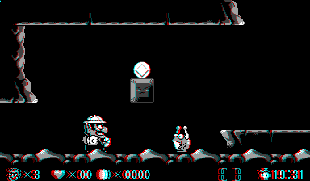
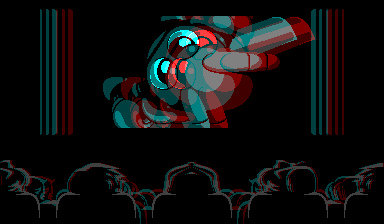
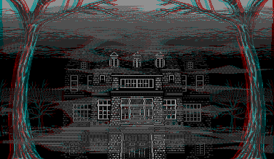
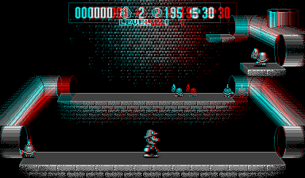

# Rustual Boy

A WIP Virtual Boy emulator in Rust.

## Status

This emulator is in its early stages (including the title, which will probably change) and covers much of the CPU, memory mapping, and video hardware. It also contains a basic command-line debugger supporting disassembly, mem dump, breakpoints, etc. Many ROM's are "compatible" so far (a few are even playable), but there's still some fundamental things that aren't yet implemented, such as some floating point flags/exceptions, bit string op's, etc.

A more detailed status section/compatibility will be written when the emu is complete enough for it to be relevant.

## Screenshots

## License

Licensed under either of

 * Apache License, Version 2.0, ([LICENSE-APACHE](LICENSE-APACHE) or http://www.apache.org/licenses/LICENSE-2.0)
 * MIT license ([LICENSE-MIT](LICENSE-MIT) or http://opensource.org/licenses/MIT)

at your option.
