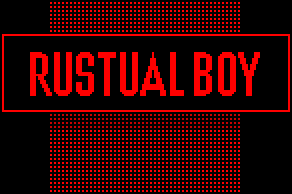
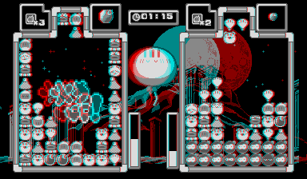
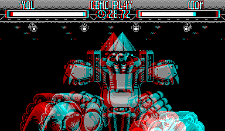

# Rustual Boy [](https://travis-ci.org/emu-rs/rustual-boy) [](https://ci.appveyor.com/project/yupferris/rustual-boy/branch/master) [](https://github.com/emu-rs/rustual-boy/blob/master/README.md#known-game-compatibility) [](https://discord.gg/65j9YMA) [](https://github.com/emu-rs/rustual-boy/blob/master/README.md#license)



## Description

Rustual Boy is a [Virtual Boy](https://en.wikipedia.org/wiki/Virtual_Boy) emulator. It can be used to play existing Virtual Boy games, as well as be a helpful development/debugging tool for homebrew for this platform.

The name "Rustual Boy" is a [portmanteau](https://en.wikipedia.org/wiki/Portmanteau) of the words "Rust" and "Virtual Boy". Ok, the "Virtual Boy" part was obvious, but why "Rust"? In fact, Rustual Boy is written in the [Rust programming language](https://www.rust-lang.org/en-US/) - a "systems programming language that runs blazingly fast, prevents segfaults, and guarantees thread safety." Rust is a wonderful language with a thriving community, and as such provides a fantastic platform for an emulation project!

## Status

Rustual Boy is currently able to emulate [the majority of commercial Virtual Boy titles](https://github.com/emu-rs/rustual-boy/blob/master/README.md#known-game-compatibility), as well as many homebrew ones as well. It supports basic video/audio output and keyboard input, as well as a simple CLI debugger. It runs on Windows, MacOS, Linux, and likely other platforms Rust supports as well.

While Rustual Boy's core emulation is nearly complete [compatibility-wise](https://github.com/emu-rs/rustual-boy/blob/master/README.md#known-game-compatibility), the project is still quite young, and needs some time to mature. Particularly, its user interface is lacking (read: virtually non-existent), and there are some known (and probably unknown) stability/compatibility issues. Also, performance isn't fantastic yet, but the emulator should be playable at least.

That said, these things are bound to improve with time, and everyone is encouraged to [grab a build](https://github.com/emu-rs/rustual-boy/releases) or [build the emulator](https://github.com/emu-rs/rustual-boy/blob/master/README.md#building-and-running), give it a shot, and [report any bugs/feature requests](CONTRIBUTING.md)!

## Screenshots





## Known game compatibility

Key:
 - Empty cells: Incompatible. The reason is described in the notes field.
 - 💖: Fully compatible. The game is fully playable with no known bugs (to our knowledge).
 - 💔: Playable. The game can be played, but has some minor known glitches (described in the notes field).
 - `-`: Game does not exist for this region.

Games marked 💖 and 💔 are all included in the compatibility metric.

| Game | USA | JP | Notes |
| --- | --- | --- | --- |
| 3-D Tetris | | - | Uses bit string ops |
| Bound High! | 💖 | - | ROM is both USA+JP |
| Galactic Pinball | 💔 | 💔 | Vocal samples throughout the game play at the wrong rate, likely related to CPU clock cycle inaccuracy |
| Golf | | | Uses bit string ops |
| Insmouse No Yakata | - | 💖 | |
| Jack Bros. | 💖 | 💖 | |
| Mario Clash | 💖 | 💖 | |
| Mario's Tennis | 💖 | 💖 | |
| Nester's Funky Bowling | | - | Uses bit string ops |
| Panic Bomber | 💖 | 💖 | |
| Red Alarm | | | Uses bit string ops |
| SD Gundam Dimension War | - | 💖 | |
| Space Invaders Virtual Collection | - | | Lazers aren't visible on most of the screen in "Virtual 3D" mode |
| Space Squash | - | | Game doesn't start; seems to be waiting on an interrupt (see commits [7423524](https://github.com/emu-rs/rustual-boy/commit/74235249a1abfca8d4b3d80e8c3c6b37230679a2) and [0ff9c61](https://github.com/emu-rs/rustual-boy/commit/0ff9c61efb188832680292a11c1a24c5c4f25360) for some investigation) |
| Teleroboxer | 💖 | 💖 | |
| V-Tetris | - | 💖 | |
| Vertical Force | | | Enemies/powerups appear/disappear, first boss disappears and the game softlocks |
| Virtual Bowling | - | 💔 | Small graphical glitch in the intro sequence, samples play at the wrong rate |
| Virtual Boy Wario Land | 💖 | 💖 | |
| Virtual Fishing | - | 💖 | |
| Virtual Lab | - | 💖 | |
| Virtual League Baseball | 💖 | 💖 | |
| Waterworld | 💖 | - | |

## Building and running

Currently, the only dependency for building is Rust itself, which can be downloaded [here](https://www.rust-lang.org/downloads.html). Once that's installed, you can clone the repo, and simply `cargo build`/`cargo run` your way to victory! It's recommended to use the `--release` flag as well, as emulation can require a lot of CPU power, so we'll want all the compiler help we can get.

Rustual Boy currently takes a single argument, which is the ROM image:

```
rustual-boy bound-high.vb
```

If you're new to using Cargo (Rust's build system), it's recommended to give the [Cargo Guide](http://doc.crates.io/guide.html) a quick skim.

## Input keymap

The Virtual Boy game pad consists of two d-pads, 4 buttons, and two shoulder buttons. These are mapped to the following keyboard keys:

| Button | Key |
| --- | --- |
| Left D-Pad Up | <kbd>W</kbd> |
| Left D-Pad Down | <kbd>S</kbd> |
| Left D-Pad Left | <kbd>A</kbd> |
| Left D-Pad Right | <kbd>D</kbd> |
| Right D-Pad Up | <kbd>I</kbd> |
| Right D-Pad Down | <kbd>K</kbd> |
| Right D-Pad Left | <kbd>J</kbd> |
| Right D-Pad Right | <kbd>L</kbd> |
| Select | <kbd>space</kbd> |
| Start | <kbd>enter/return</kbd> |
| A | <kbd>F</kbd> |
| B | <kbd>H</kbd> |
| Left bumper | <kbd>E</kbd> |
| Right bumper | <kbd>U</kbd> |

For game pad layout reference, refer to [this image](https://en.wikipedia.org/wiki/Virtual_Boy#/media/File:Virtual-Boy-Set.jpg). This key map is currently non-configurable.

## Contributing

Rustual Boy aims to be an open project where anyone can contribute. If you're interested, check [CONTRIBUTING.md](CONTRIBUTING.md)!

## License

Licensed under either of

 * Apache License, Version 2.0, ([LICENSE-APACHE](LICENSE-APACHE) or http://www.apache.org/licenses/LICENSE-2.0)
 * MIT license ([LICENSE-MIT](LICENSE-MIT) or http://opensource.org/licenses/MIT)

at your option.
